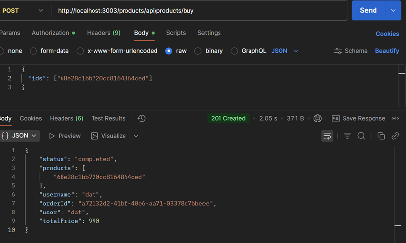

1.	Github link: 3002tad/22695761-NguyenThanhDat-EProject
2.	Setup all microservices
-	Create .env file
 
-	hard code to config.URI
 
-	 Include username in the JWT payload so other services can read it from req.user
 
-	Add “username” to db

 

3.	Test all business logic with POSTMAN

-	Register
 

 
-	Login
 

-	Create Product
 

 
-	View Product
 

 
-	Create Order

 

 

 

 

 
